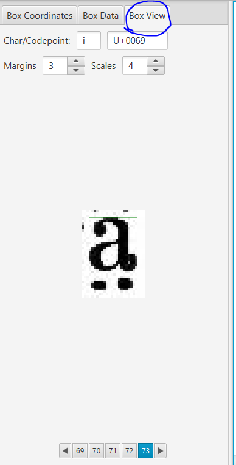

# 用 jTessBoxEditor 做字符標註

為了訓練 OCR 我們需要標註在圖片中標註出每個字符的位置，和相應的字符。

## 第 1 步 下載 

- 如果你的電腦還未安裝 Java，請前往 `https://java.com/` 下載。 版本 8 以上即可。

- 我們用 [jTessBoxEditor](http://vietocr.sourceforge.net/training.html)。

可以在這裡下載：
```
https://sourceforge.net/projects/vietocr/files/jTessBoxEditor/
```

Windows 用戶選擇 `jTessBoxEditorFX-2.0-Beta.zip`

- 下載後解壓縮到一個文件夾，如 `C:\jTessBoxEditor`, 下文用 `<jTessBoxEditorFolder>` 表示。

## 第 2 步 打開
- 在文件瀏覽器中打開 `<jTessBoxEditorFolder>`。會看見裡面有一個 `jTessBoxEditorFX.jar` 的文件，打開它，看到如下界面。


## 第 3 步 切 Box
- 首先，設置一些參數：
  - 在 Trainer 標籤頁，
    - Tessract Executables 設為 `<jTessBoxEditorFolder>\tesseract-ocr` 
    - Training Data 設為 你存放訓練圖片的目錄。
    - Language 和 Bootstrap Language 都設為 `eng`
    - RTL 不選
    - Training Mode 選擇 `Make Box File Only`
      

 - 然後，點擊 `Run`

Tesseract 會按英文識別來做一個初步的字符切割。

## 第 4 步 調整 Box
 - 切換到 Box Editor 標籤頁
 - 點擊 `Open`，打開你其中一張訓練圖片（比如第一張），看到如下界面：


因為識別出來的文字邊框很多是不準的，所以我們要一一**人工校對**。😱

- 首先，選中一個框，看到它變成紅色：


- 使用右上角的 X、Y、W、H 來調整紅框的左右位置、上下位置、寬度、高度。


- 可以用左邊的 Box View 面板，來輔助（放大）觀察字符：



要調整到正好四面貼合的狀態。

遇到像字母 i 上下分離的情況，先按住 Ctrl 選中兩個 Box:


然後點擊工具欄的  按鈕

遇到沒被框起來的字符，可以用 `Split` 把已有的框拆成兩個，或者先選中附近的一個 Box 然後按 `Insert`。

> 要記得經常按 `Save` 保存哦。我個人發現似乎有的時候Save不正常，保險起見可以用 `Save As` 備份到另外一個位置，以免丟失進度。

# 第 5 步 標註字符

矯正完框框的位置，下一步是要告訴 Tesseract 每一個框框裡面對應的是什麼字符。

可以看到左邊 Box Coordinates 標籤頁裡面已經有初步的識別結果：


要做的就是：
 - 在右邊圖片上點擊每一個要修改的字符
 - 在左邊 Char 列上雙擊對應的單元格
 - 輸入正確的字符
 - **回車**

> 技巧：在右邊圖片可以用鼠標按順序劃過每一個框框，可以看到對應的字符，只有看到不對的時候才需要編輯。
